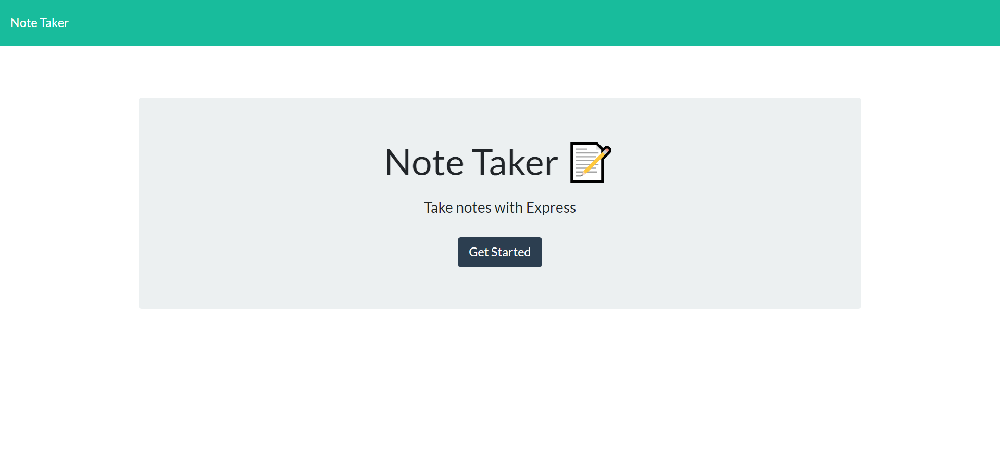
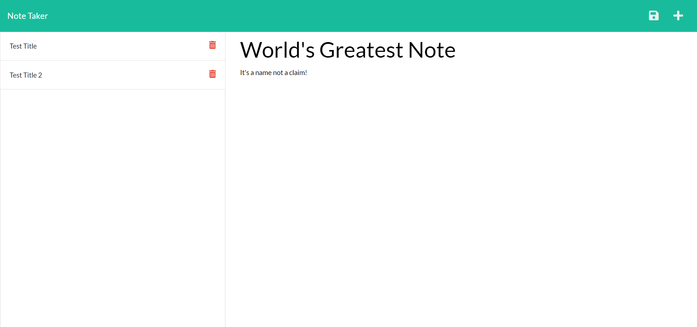

# Gordon Note Taker

## Description

This is a note taker application that utilizes an express.js backend, as well as util and uuid. This application displays existing notes (persisting data), uses uuid to create unique ids for all new notes, and is deployed to Heroku.

## Table of Contents

*[Installation](#installation)

*[License](#license)

*[Contributing](#contributing)

*[Questions](#questions)

## Installation

The page is deployed to Heroku [here](https://agile-brook-83776.herokuapp.com/). For developers, please run npm init in the command line to ensure all dependencies are loaded, then run npm start to start the local host server

## Usage

When opened, the application shows a landing page with a link to a notes page. When the link is clicked on, the notes page will open and show existing notes on the left hand side, and empty fields for Title and Text on the right hand side.  When a title and text are both entered, a save icon will appear.  Once that save icon is clicked, the created note will populate on the left hand side with existing notes.  If any of the existing notes are clicked on, their title and text will show on the right hand side.  All existing notes have a trash icon that, when clicked, will delete the note. There is also a plus sign in the top right corner of the page that, when clicked, will present the user with empty title and text fields to create a new note.

Application is deployed to [Live URL via Heroku](https://agile-brook-83776.herokuapp.com/)

Application [GitHub URL](https://github.com/Mike2481/Gordon-Note-Taker)

screenshots:

## License
This application is covered under the [MIT](./License/MIT.txt) license.
  
## Contributing

Pull request are welcome.  For major changes, please open an issue first to discuss what you would like to change.

## Questions

If you have any questions, please contact me by [email](mailto:vprmatrix55@gmail.com) or through [Github](https://github.com/Mike2481)

